# Internal Documentation & Component Interaction Flows

Generate comprehensive project documentation for: **$ARGUMENTS**

## Process

1. **Explore** — scan project structure, trace every entry point through all layers
2. **Catalog** — list all components, interfaces/ports, data types, errors, dependencies
3. **Structure** — plan doc series: overview docs + per-entry-point flow docs
4. **Write** — generate all docs (use sub-agents for parallelism)
5. **Verify** — automated completeness checks

---

## Phase 1: Deep Exploration Checklist

Before writing any documentation, thoroughly explore the codebase and discover:

### Project Foundations
- Project purpose, domain, and target users
- Tech stack (language, framework, runtime, build tools)
- Repository structure and module/package organization
- Build, test, and run commands
- Environment requirements (env vars, external services, credentials)

### Entry Points
- CLI commands, subcommands, and their option parsers
- API handlers (REST endpoints, gRPC services, GraphQL resolvers)
- Event listeners, message consumers, webhook handlers
- Scheduled jobs, cron tasks, background workers

### Interface / Port Boundaries
- Interfaces, traits, or abstract classes that separate layers
- Dependency injection wiring (what concretions implement each port)
- Adapter pattern usage (how infrastructure adapts to domain contracts)

### Data Types Crossing Boundaries
- DTOs, request/response objects, command/query objects
- Domain entities, value objects, aggregates returned through ports
- Configuration structs, options objects
- Serialization boundaries (JSON, protobuf, SQL row mapping)

### Error Types and Propagation
- Error types, sentinel errors, error codes, exception hierarchies
- Where errors originate (which layer/component)
- How errors propagate (wrapped, mapped, swallowed, bubbled)
- Recovery strategies (retry, fallback, circuit breaker, abort)

### Dependencies and External Systems
- Third-party libraries and their roles
- External services (databases, caches, message brokers, APIs)
- File system artifacts (config, schemas, templates, state, output files)
- Network boundaries and protocols

### Concurrency Patterns
- Goroutines, threads, workers, async tasks
- Locks, mutexes, semaphores, channels
- Transaction boundaries and isolation levels
- Advisory locks, distributed locks

### Configuration Loading
- How config flows from env vars / files / flags into the application
- Config validation and defaults
- Config precedence order

---

## Phase 2: Doc Series Structure

Plan the file layout. Exploratory docs first, then one overview + per-entry-point flow files:

```
docs/                                # or plans/, docs/internal/, etc.
  PROJECT_OVERVIEW.md                # What this project is, tech stack, how to run
  ARCHITECTURE.md                    # Layers, patterns, dependency graph (Mermaid)
  FLOW_OVERVIEW.md                   # Shared flow foundations (ports, types, errors)
  FLOW_{ENTRY_POINT_1}.md           # Per-entry-point interaction flow
  FLOW_{ENTRY_POINT_2}.md
  FLOW_{ENTRY_POINT_3}.md
  ...
```

Naming conventions:
- `PROJECT_OVERVIEW.md` — always one file, the starting point for any reader
- `ARCHITECTURE.md` — always one file, static structure and dependency view
- `FLOW_` prefix + entry point name in UPPER_SNAKE_CASE for interaction docs
- If the project uses a numbered doc series (e.g., `01_`, `11_`), prefix accordingly

---

## Phase 3: Project Overview Template

Create `PROJECT_OVERVIEW.md` — the first document any reader should open:

```markdown
# [Project Name] — Overview

## What This Project Does

[2-3 sentences: what problem it solves, who uses it, what it produces.]

## Tech Stack

| Layer | Technology | Purpose |
|-------|-----------|---------|
| Language | `Go 1.22` / `TypeScript 5` / etc. | — |
| Framework | `Cobra` / `Express` / `Spring Boot` / etc. | CLI / HTTP / etc. |
| Database | `PostgreSQL 16` / `SQLite` / etc. | primary data store |
| Build | `go build` / `npm` / `gradle` / etc. | compilation, bundling |
| Test | `go test` / `jest` / `pytest` / etc. | test runner |
| CI/CD | `GitHub Actions` / `GitLab CI` / etc. | automation |

## Repository Structure

[Directory tree with 1-line descriptions for each top-level directory/module]

```
project/
├── cmd/              # CLI entry points
├── internal/         # Core business logic (not importable)
│   ├── domain/       # Entities, value objects, port interfaces
│   ├── app/          # Use cases, orchestration
│   └── infra/        # Database, file system, external API adapters
├── pkg/              # Shared libraries (importable)
├── migrations/       # Database migration files
├── config/           # Configuration files and templates
├── docs/             # Documentation (you are here)
└── tests/            # Integration and E2E tests
```

## Quick Start

```bash
# Prerequisites
[list required tools, versions, env setup]

# Build
[build command]

# Run
[run command with example args]

# Test
[test command]
```

## Key Concepts / Glossary

| Term | Definition |
|------|-----------|
| `Term1` | [what it means in this project's domain] |
| `Term2` | [what it means in this project's domain] |

## Configuration Reference

| Variable / Flag | Default | Description |
|----------------|---------|-------------|
| `ENV_VAR` | `value` | [what it controls] |
| `--flag` | `value` | [what it controls] |

## Document Index

- [Architecture](ARCHITECTURE.md) — layers, patterns, dependency graph
- [Flow Overview](FLOW_OVERVIEW.md) — shared foundations for interaction flows
- [Flow: Entry1](FLOW_ENTRY1.md) — [1-line summary]
- [Flow: Entry2](FLOW_ENTRY2.md) — [1-line summary]
```

---

## Phase 4: Architecture Document Template

Create `ARCHITECTURE.md` — static structure, layers, and dependency view:

```markdown
# [Project Name] — Architecture

## Architecture Style

[Clean Architecture / Hexagonal / DDD / MVC / etc.]
[1-2 sentences on why this style was chosen or evolved.]

## Layer Diagram

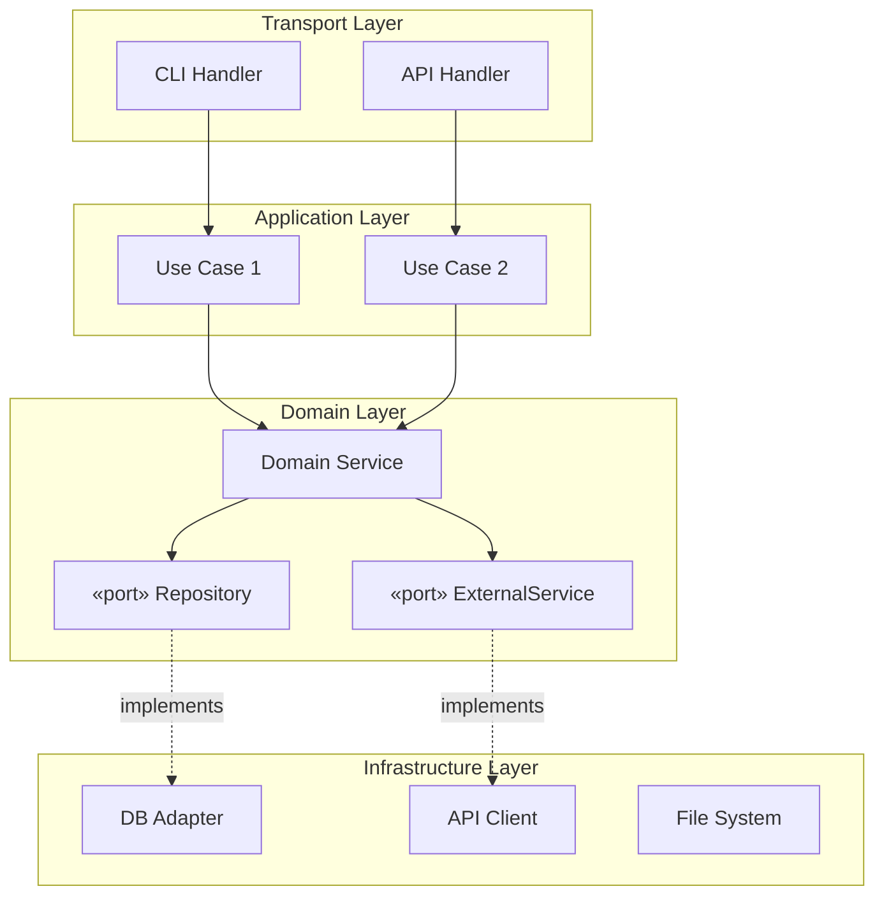

## Module / Package Dependency Graph

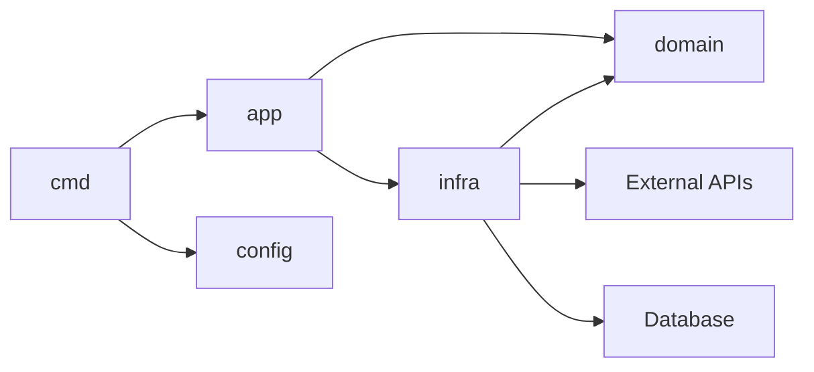

## Key Patterns

| Pattern | Where Used | Why |
|---------|-----------|-----|
| Repository | data access | decouples domain from DB |
| Strategy | [module] | [reason] |
| Factory | [module] | [reason] |
| Observer/Event | [module] | [reason] |

## External Dependencies

| Dependency | Type | Purpose | Failure Impact |
|-----------|------|---------|----------------|
| PostgreSQL | database | primary data store | service down |
| Redis | cache | session / rate limit | degraded perf |
| S3 | storage | file uploads | upload fails |

## Data Model

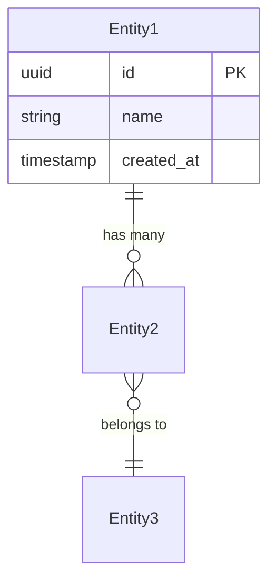

[Or use a class diagram for domain types:]

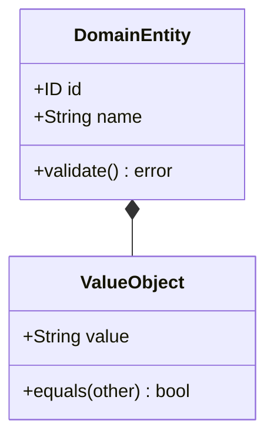

## Security Boundaries

[Authentication flow, authorization model, trust boundaries between layers]

## Cross-References

- [Project Overview](PROJECT_OVERVIEW.md)
- [Flow Overview](FLOW_OVERVIEW.md) — runtime interaction details
```

---

## Phase 5: Flow Overview File Template

Create `FLOW_OVERVIEW.md` with shared foundations for all interaction flows:

```markdown
# Component Interaction Flows — Overview

## How to Read These Docs

All interaction diagrams use **Mermaid sequence diagram** syntax:

- Solid arrows (`->>`) = synchronous calls
- Dashed arrows (`-->>`) = return values / responses
- Colored activations = processing time on that participant
- `Note over` blocks = port boundary crossings and data type annotations
- `alt` / `opt` / `loop` blocks = branching, optional steps, repetition

Each `FLOW_*.md` file documents one entry point end-to-end.
This overview covers shared foundations referenced by all flow docs.

## Universal Pre-flight

[What happens before ANY entry point executes — config loading,
 dependency injection, logger setup, connection pool init, etc.]

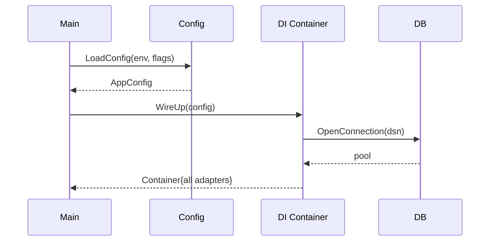

## Interface / Port Map

| Port (Interface) | Methods | Implemented By | Layer Boundary |
|-------------------|---------|----------------|----------------|
| `PortName` | `Method1`, `Method2` | `AdapterName` | domain → infra |
| ... | ... | ... | ... |

## Data Types Crossing Boundaries

| Type | Direction | From → To | Purpose |
|------|-----------|-----------|---------|
| `TypeName` | in | transport → domain | command input |
| `TypeName` | out | domain → transport | result output |
| ... | ... | ... | ... |

## Error Catalog

| Error | Origin | Propagation Path | Recovery |
|-------|--------|-------------------|----------|
| `ErrName` | `component` | component → caller → transport | user message |
| ... | ... | ... | ... |

## File System Artifact Lifecycle

| Artifact | ENTRY_1 | ENTRY_2 | ENTRY_3 | ... |
|----------|---------|---------|---------|-----|
| `file.ext` | R | R/W | — | ... |
| `other.ext` | W | — | R | ... |

Legend: R = read, W = write, R/W = both, — = not touched

## Cross-References

- [Project Overview](PROJECT_OVERVIEW.md) — what this project is
- [Architecture](ARCHITECTURE.md) — static structure and dependencies
- [FLOW_ENTRY_1.md](FLOW_ENTRY_1.md) — [1-line summary]
- [FLOW_ENTRY_2.md](FLOW_ENTRY_2.md) — [1-line summary]
```

---

## Phase 6: Per-Entry-Point File Template

Create one `FLOW_{ENTRY_POINT}.md` per entry point:

```markdown
# ENTRY_POINT — Interaction Flow

## Summary

[1 paragraph: what this entry point does, who calls it, what it produces.]

## Participants

| # | Component | Layer | Source File | Interface |
|---|-----------|-------|-------------|-----------|
| 1 | `CompName` | transport | `path/to/file.go:42` | — |
| 2 | `CompName` | application | `path/to/file.go:88` | `PortName` |
| ... | ... | ... | ... | ... |

## Full Interaction Diagram

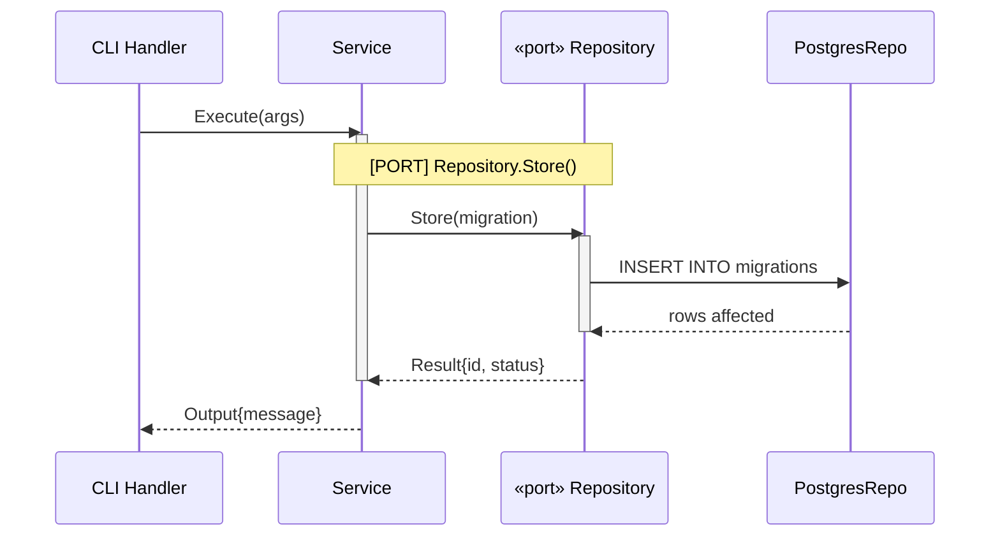

For complex flows, split into phases:

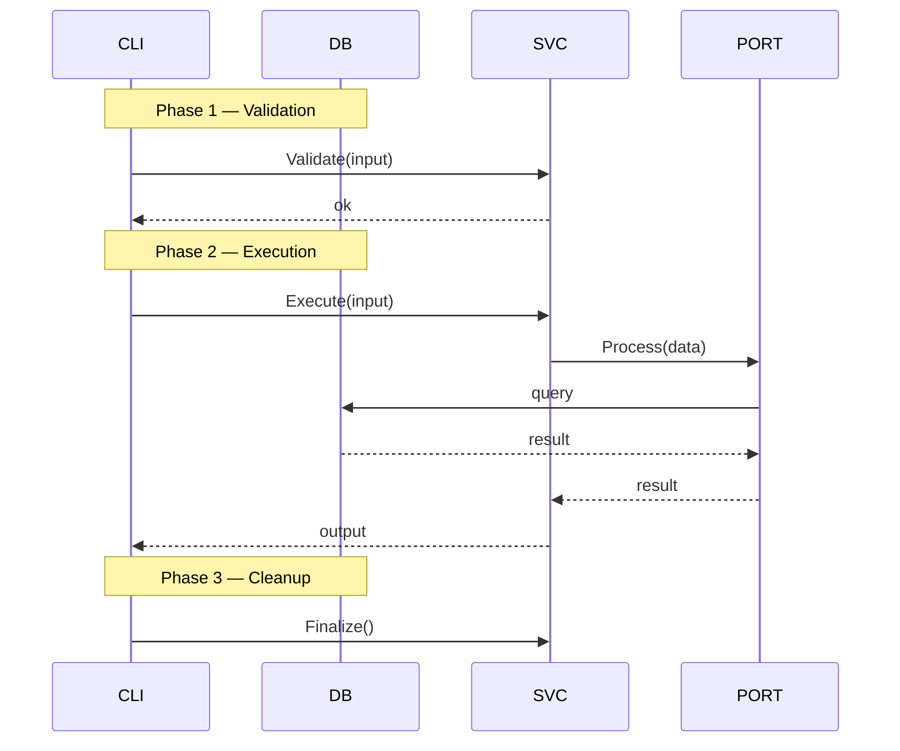

## Step-by-Step Narrative

### Step 1: CLI Handler → Service
- **Interface crossed**: none (same layer) or `[PORT] PortName.Method()`
- **Data in**: `ArgType` — [describe fields]
- **What happens**: [1-2 sentences]
- **Data out**: proceeds to Step 2

### Step 2: Service → Repository (via port)
- **Interface crossed**: `[PORT] Repository.Store()`
- **Data in**: `MigrationType` — [describe fields]
- **What happens**: [1-2 sentences]
- **Data out**: `ResultType` — [describe fields]

[Continue for each step...]

## Branching Points

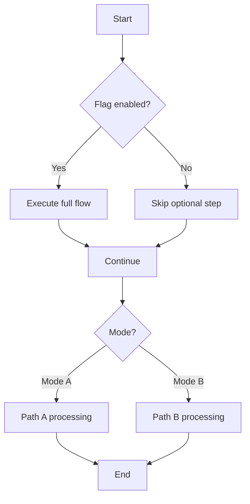

| Condition | Branch | Effect |
|-----------|--------|--------|
| `flag == true` | skip Step 3 | [what changes] |
| `input.Mode == X` | alternate Step 5 | [what changes] |

## Interface Boundary Summary

| Crossing | Direction | Port | Method | Data Type |
|----------|-----------|------|--------|-----------|
| Step 2 | → | `PortName` | `Method` | `ArgType` |
| Step 5 | ← | `PortName` | `Method` | `ResultType` |

## Files Read / Written

| File | Operation | When |
|------|-----------|------|
| `path/to/file.ext` | Read | Step 3 — loaded for [reason] |
| `path/to/output.ext` | Write | Step 7 — [what is written] |

## Error Scenarios

| Error | Origin Step | What Triggers It | Recovery |
|-------|------------|------------------|----------|
| `ErrName` | Step 3 | [condition] | [what happens] |
| ... | ... | ... | ... |

## Cross-References

- Overview: [FLOW_OVERVIEW.md](FLOW_OVERVIEW.md)
- Architecture: [ARCHITECTURE.md](ARCHITECTURE.md)
- Related: [FLOW_OTHER.md](FLOW_OTHER.md) — [why related]
```

---

## Phase 7: Mermaid Diagram Conventions

Use these Mermaid patterns consistently across all flow documents:

### Sequence Diagrams (primary — for interaction flows)
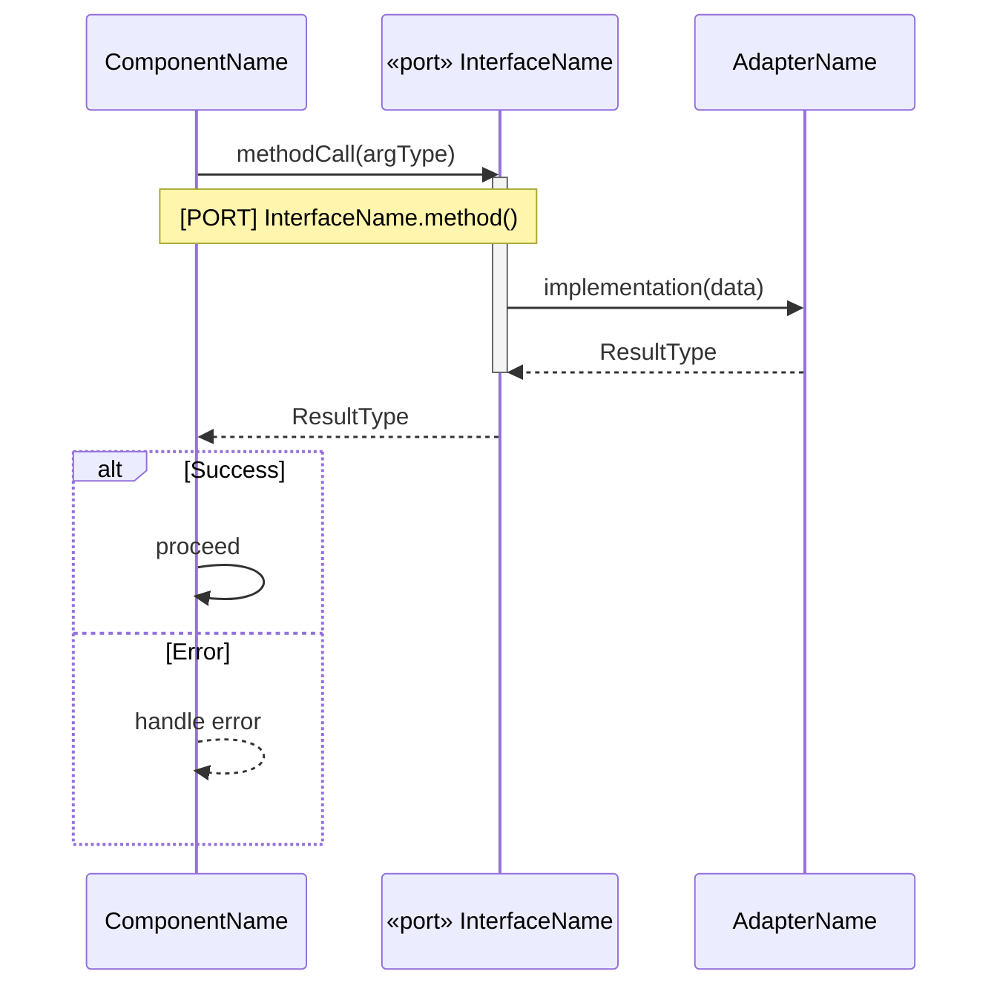

Conventions:
- Name participants as `«port» Name` when they represent an interface/port
- Use `Note over X,Y` to annotate port boundary crossings: `[PORT] Name.Method()`
- Use `activate` / `deactivate` to show processing scope
- Use `alt` / `opt` / `loop` / `par` blocks for branching and concurrency
- Annotate arrow labels with method names and data types

### Flowcharts (for branching logic and decision trees)
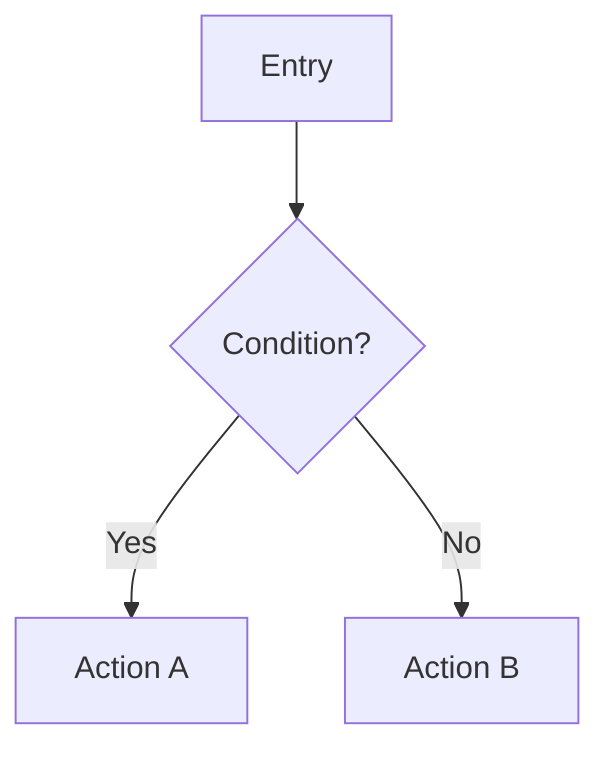

### Entity-Relationship (for data models)
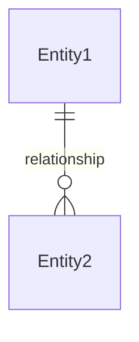

### Class Diagrams (for domain types and interfaces)
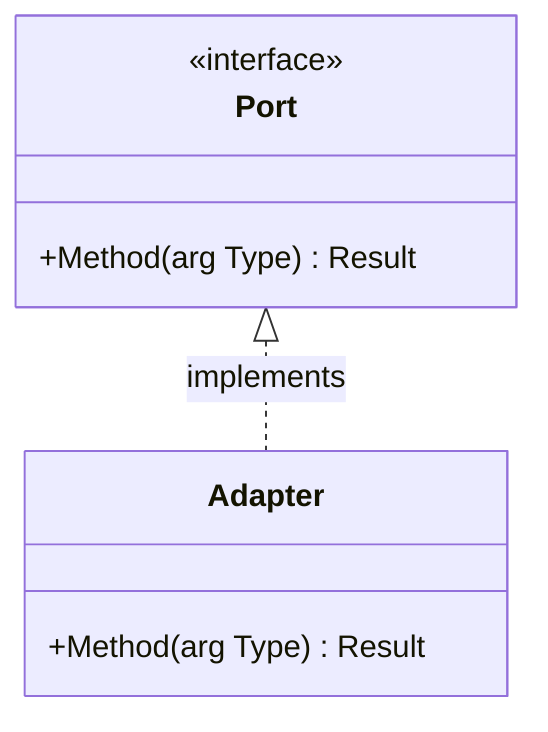

### Graph (for dependency and architecture diagrams)
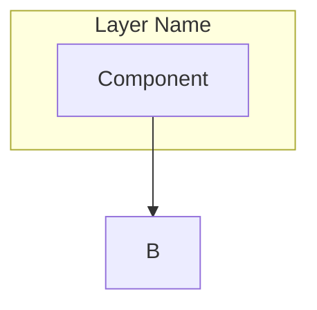

---

## Phase 8: Verification Checklist

After writing all files, verify completeness:

### Exploratory Docs
- [ ] `PROJECT_OVERVIEW.md` has tech stack, repo structure, quick start, glossary
- [ ] `ARCHITECTURE.md` has layer diagram, dependency graph, key patterns, data model
- [ ] All Mermaid diagrams in architecture doc render correctly
- [ ] Glossary terms cover all domain-specific vocabulary

### Flow Docs
- [ ] Every entry point discovered in Phase 1 has its own `FLOW_*.md` file
- [ ] All interfaces/ports from the codebase appear in OVERVIEW with correct methods
- [ ] All domain types that cross boundaries are documented in the type table
- [ ] All error types/sentinels match source code (grep to confirm)
- [ ] File artifact matrix matches actual I/O (grep for file operations)

### Cross-Cutting
- [ ] Cross-references between all files resolve (no broken links)
- [ ] No implementation code in docs — only names, types, signatures, diagrams
- [ ] Mermaid diagram conventions are consistent across all files
- [ ] Source file paths in participant tables point to real files
- [ ] Branching points cover all major conditional paths
- [ ] Document index in PROJECT_OVERVIEW lists all generated files

Run verification programmatically where possible:
```
# Check all ports are documented
grep -r "interface\|trait\|abstract" src/ | extract names → compare with OVERVIEW

# Check all errors are documented
grep -r "Err\|Error\|Exception" src/ | extract types → compare with error catalog

# Check file operations are documented
grep -r "os.Open\|os.Create\|ReadFile\|WriteFile" src/ → compare with artifact matrix

# Check Mermaid syntax is valid
find docs/ -name "*.md" -exec grep -l "mermaid" {} \; | while read f; do
  # extract mermaid blocks and validate
done
```

---

## Rules

- **Project overview first** — every doc series starts with PROJECT_OVERVIEW.md so readers know what they're looking at
- **Architecture before flows** — static structure provides context for dynamic behavior
- **One file per entry point** — keeps each flow doc focused and scannable
- **Overview file for shared concepts** — avoids duplication across flow docs
- **Mermaid diagrams only** — rendered natively by GitHub, GitLab, Obsidian, and most doc tools; still diff-friendly in source
- **Document interfaces not implementations** — focus on what crosses boundaries, not internal logic
- **Include source file paths** — so readers can jump directly to code
- **Use sub-agents for parallel writing** — provide each agent with full exploration context upfront; each agent writes one or more files independently
- **Verify completeness programmatically** — don't trust manual review alone; grep the codebase to confirm coverage
- **Split complex diagrams into phases** — keep each Mermaid block focused on one phase of the flow
- **Update when code changes** — stale docs are worse than no docs

---

## Example

Reference instance from schema-pilot doc 11 series:

```
PROJECT_OVERVIEW.md    — tech stack, repo structure, glossary, config reference
ARCHITECTURE.md        — hexagonal layers, port/adapter map, dependency graph

FLOW_OVERVIEW.md       (262 lines) — 8 ports, 15 errors, type catalog
FLOW_GENERATE.md       (184 lines) — 12-step pipeline, 6 port crossings
FLOW_MIGRATE.md        (160 lines) — advisory lock, heartbeat, 3 tx modes
FLOW_DIFF.md            (83 lines) — simplest flow, 3 steps
FLOW_LINT.md           (105 lines) — 15 analyzers, env-aware severity
FLOW_DRIFT.md          (159 lines) — introspection, drift ≠ diff distinction
FLOW_MERGE.md          (113 lines) — DAG resolution, conflicts, resequencing
FLOW_STATUS.md          (66 lines) — read-only, no port boundary crossings
```

Characteristics of good docs:
- Project overview gives any reader enough context to understand all other docs
- Architecture doc shows the static "what connects to what" before flows show "what happens at runtime"
- Overview was ~260 lines covering 8 ports, 15 errors, and full type catalog
- Per-command files ranged from 66 lines (simple read-only) to 184 lines (complex pipeline)
- Every port crossing annotated with `Note over` blocks in Mermaid sequence diagrams
- Error tables matched 1:1 with source code sentinel errors
- File artifact matrix covered all config, schema, and output files
- All diagrams used consistent Mermaid conventions throughout the series
